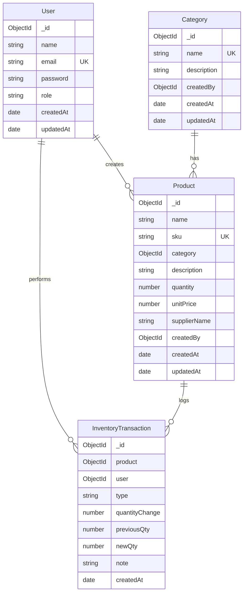

# Database ER Diagram

## Notes

- Product **status** is derived at runtime from `quantity` and `LOW_STOCK_THRESHOLD` (not stored).
- Roles: `admin`, `staff`.
- Category delete is blocked when products still reference the category.
